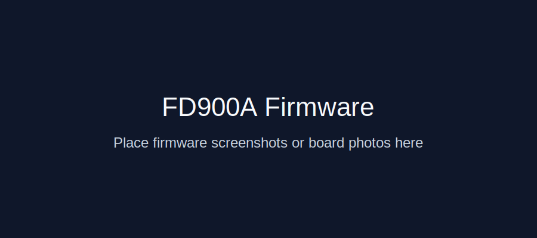
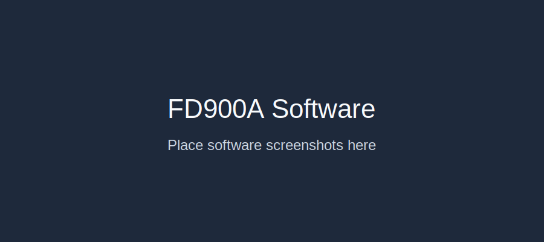

# FD900A Metal Case Help and Firmware

This repository provides a simple starting structure for the **FD900A metal case** project.

## Repository folders

- **Firmwares/** – firmware files and release packages.
- **Software/** – tools and software used with the FD900A.
- **3dmodel/** – 3D model files for the metal case.

## Pictures

### Firmware

### Software

### 3D model

